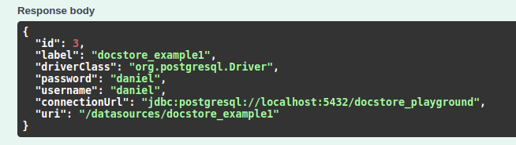
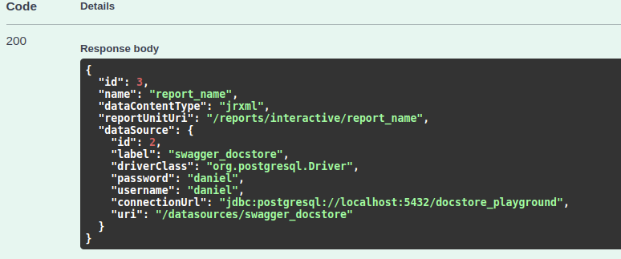
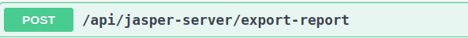
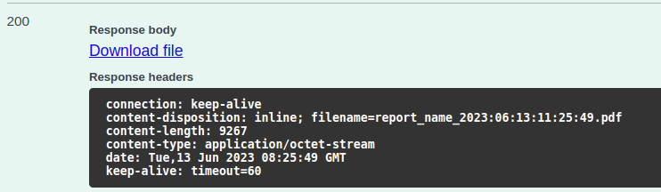

# jasperDemo

 ### Scenario : ###
- user uploads a jrxml file to the app and provides the data source for his template 
- user can download the report in the format he choses (pdf,html etc)

 ### Features ###
- user can add new reports in jrxml
- user can add new datasources
- user can view the datasources
- user must view his reports

How the exporting a report works


 ### Endpoints ###
___


_Example of request body :_
```
{
"label":"docstore_example",
"driverClass":"org.postgresql.Driver",
"password":"daniel",
"username":"daniel",
"connectionUrl":"jdbc:postgresql://localhost:5432/docstore_playground"
}
```
_Example of succesfull response:_



___


_Example of request body :_
**!data should contain encoded version of file to base64**
```
{
  "label": "report_name",
  "type": "jrxml",
  "data": "...",
  "dataSourceId": 1
}
```

_Example of succesfull response:_



___



_Example of request body :_ **format should be lowercase and can be html, pdf**

```
{
  "id": 3,
  "format": "pdf"
}
```

_Example of succesfull response:_



___

### How to start the app ###

for Linux :

- download and extract jasper server to a folder

- in terminal go to installed folder and type \
   **./ctlscript.sh start**

additional info:
- the server starts on port 8081 or 8080 if free
- credentials : jasperadmin, jasperadmin
- url : http://localhost:8080/jasperserver/login.html
