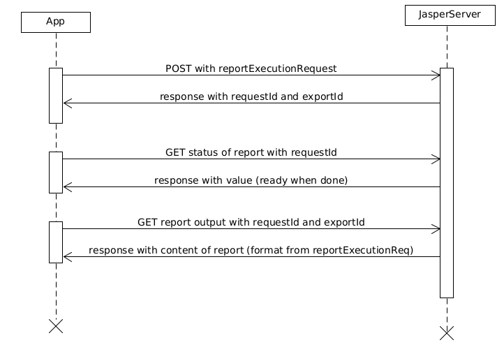

# jasperDemo

 ### Scenario : ###
- user uploads a jrxml file to the app and provides the data source for his template 
- user can download the report in the format he choses (pdf,html etc)

 ### Features ###
- user can add new reports in jrxml
- user can add new datasources
- user can view the datasources
- user must view his reports

Run async report diagram
